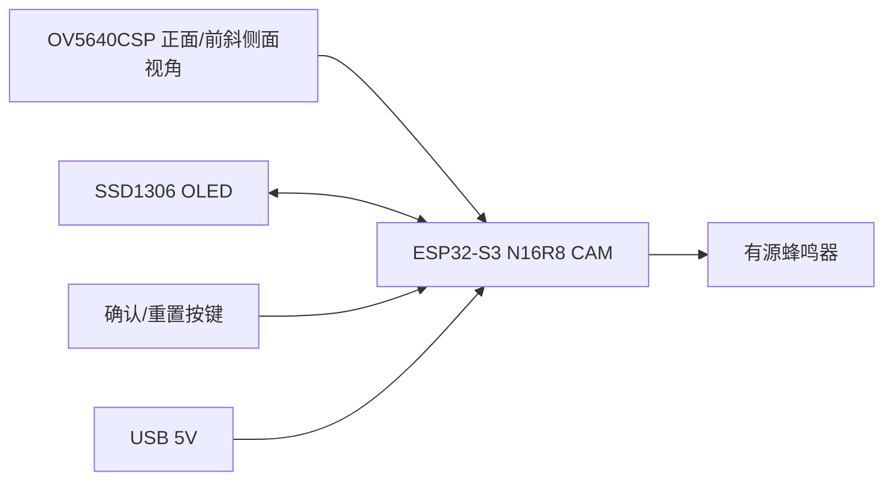
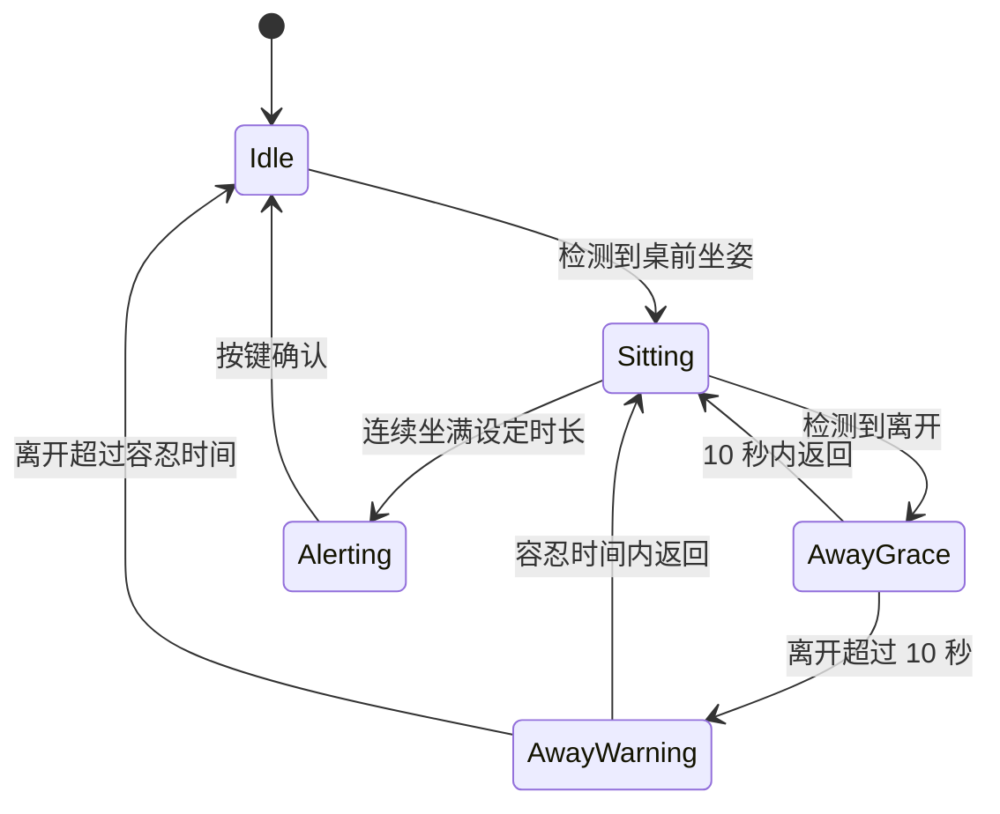

# 技术架构

## 系统目标

设备独立完成桌前坐姿检测、久坐计时、屏幕显示和站立提醒。当前主线迁移到 ESP-IDF，本地运行坐姿/离开二分类模型；设备预计放在显示器上或桌面上，摄像头主要看到人的正面或前斜侧面坐姿，不做身份识别，不上传图像。

## 硬件架构

## 软件模块

- `camera_capture`：采集低分辨率灰度图，并提供本地 AP 预览和样本采集接口。
- `seat_model`：对画面中部偏上的 8x8 灰度特征做 int8 二分类推理，输出桌前坐姿概率。
- `camera_presence`：优先使用模型概率判断是否有人保持桌前坐姿；模型未训练或初始化失败时回退到 ROI 灰度差分。
- `sedentary_timer`：维护待机、计时、暂离、即将重置、提醒状态。
- `display_ui`：显示当前状态、剩余时间、暂离时间和提醒信息。
- `alert_output`：控制蜂鸣器提醒节奏。
- `button_input`：处理确认、静音和手动重置。
- `web_api`：提供 `/capture`、`/status`、`/settings`、`/reset`、`/label?class=absent|seated`，支持网页调节倒计时和离场容忍时间，并兼容旧 `empty|occupied` 标签。

## 状态机

## 计时规则

- 坐下后记录 `sitStartMs`，用当前时间减去坐下开始时间计算已坐时间。
- 10 秒内暂离不重置，也不扣除暂离时间。
- 离开 10 秒到设定容忍时间期间显示“即将重置”。
- 离开超过设定容忍时间后丢弃本轮计时，回到待机。
- 满设定倒计时时长后进入提醒状态，直到按键确认。

## 摄像头检测策略

当前主线采用本地模型 + fallback 策略：

- 只采集低分辨率灰度图，例如 `QVGA`。
- 固定画面中部偏上的人体/上半身区域 ROI，并下采样为 8x8 灰度特征；默认向上偏置，优先覆盖头部、肩部和上半身。
- 本地 int8 二分类模型输出 `occupiedProbability`，默认阈值 `0.65`；这里的 occupied 表示“桌前坐姿存在”。
- 连续多帧达到阈值后判定有人，连续多帧低于阈值后判定无人。
- 如果模型未训练或推理不可用，回退到原 ROI 灰度差分逻辑。
- AP 提供 `/label?class=absent|seated`，用于采集真实安装角度样本。

后续可升级：

- 增加 Web 配置页调 ROI、阈值和模型版本。
- 将当前 int8 特征分类器替换为 TFLite Micro 坐姿/人体模型，复用 `SeatModel` 接口。
- 参考 ESP-WHO / ESP-DL / ESP-Detection 做更完整的人体姿态或坐姿检测。
- 增加毫米波雷达或 PIR 作为辅助传感器，降低误判。

## 隐私边界

- 不保存照片。
- 不上传图像。
- 默认只创建本地 AP，不连接外部网络。
- 只输出布尔占用状态给计时模块。
