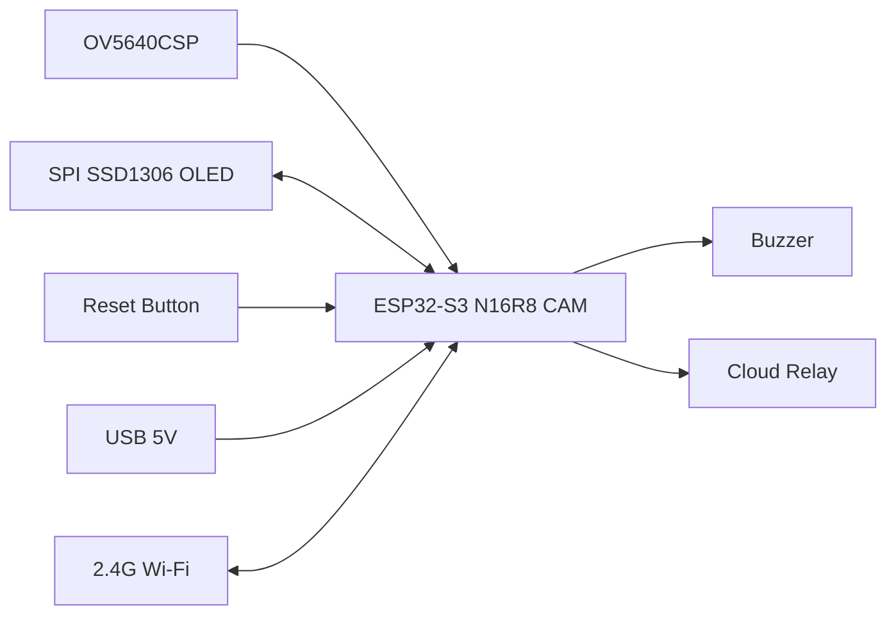
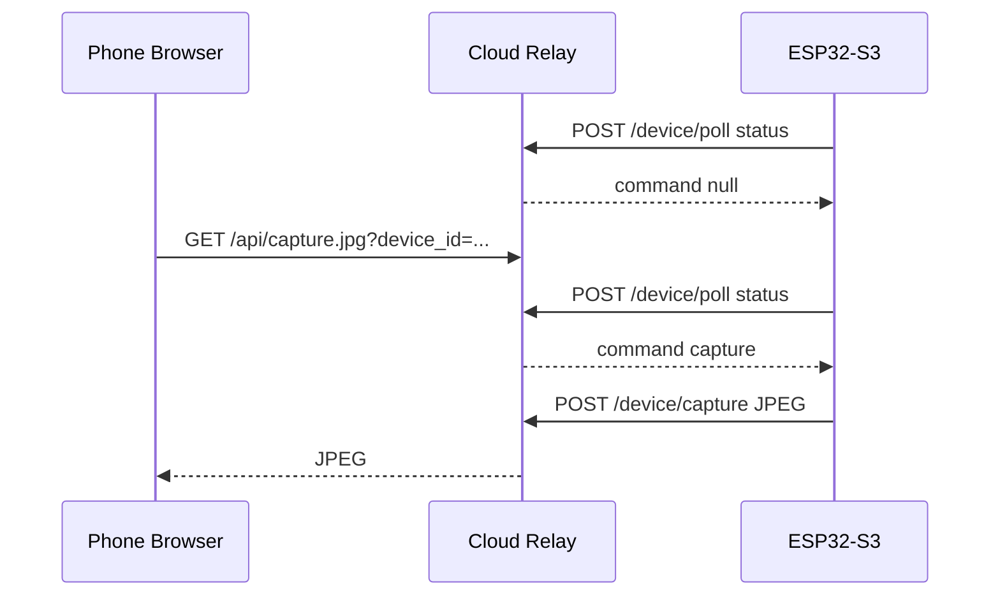

# 技术架构

## 目标

设备本地完成桌前坐姿检测、久坐计时、OLED 显示和蜂鸣器提醒。网络分两层：

- 本地兜底：`Bell-Robot` 热点用于首次配置、联网失败后的修复和现场调试。
- 云端远程：设备主动连接云中转；手机通过服务器网页远程查看状态、修改设置、重置和按需获取摄像头快照。

## 硬件

## 固件模块

- `camera_capture`：采集灰度图，提供本地预览、样本导出和云端按需 JPEG 快照。
- `seat_model`：对 `8x8` 灰度特征做本地 int8 二分类，输出桌前坐姿概率。
- `presence_detector`：模型优先，模型不可用时回退 ROI 灰度差分，并做连续帧去抖。
- `sedentary_timer`：处理待机、计时、暂离暂停、超时重置和提醒状态。
- `display_ui`：OLED 只显示状态、倒计时和 `PROB xx%`。
- `web_api`：本地 AP 调试接口，包括 `/capture`、`/status`、`/settings`、`/cloud`、`/reset`、`/label`。
- `cloud_client`：STA 联网后每秒轮询云中转，上报状态并执行云端命令。

## 设备身份

- `device_id` 由芯片 MAC 自动生成，例如 `bell-robot-f63910`。
- 旧默认 ID `bell-robot-1` 会在启动时自动迁移为 MAC ID。
- 设备 token 由固件随机生成并保存到 NVS，不显示给用户。
- 服务器第一次看到新 `device_id` 时自动登记；之后同一 `device_id` 必须继续使用同一个 token。

## 远程访问数据流

## 隐私边界

- 设备默认不持续上传画面。
- 只有网页请求 `/api/capture.jpg` 时，设备才上传一张 JPEG。
- 云中转只持久化设备登记信息，不落盘保存摄像头图片。
- 坐姿识别和计时仍在设备本地完成，不依赖云端模型。

## 当前安全边界

网页登录密码已按现场需求取消。当前公网地址只适合受控使用；后续正式给多人使用时，应在 Nginx/Caddy 或应用层补回访问控制和 HTTPS。
