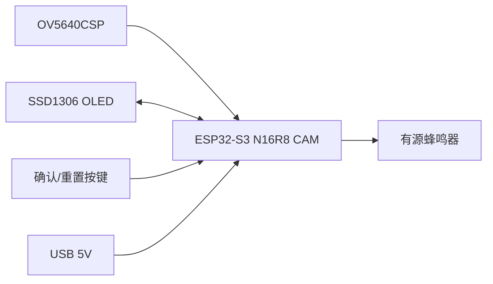
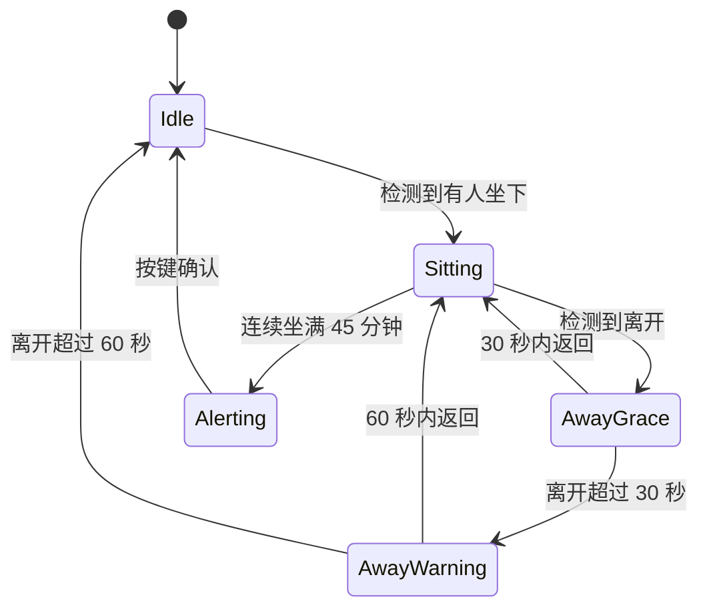

# 技术架构

## 系统目标

设备独立完成椅子占用检测、久坐计时、屏幕显示和站立提醒。第一版优先快速原型，不做联网、不做身份识别、不保存图像。

## 硬件架构

## 软件模块

- `camera_presence`：采集低分辨率灰度/亮度信息，对椅子 ROI 做占用判断。
- `sedentary_timer`：维护待机、计时、暂离、即将重置、提醒状态。
- `display_ui`：显示当前状态、剩余时间、暂离时间和提醒信息。
- `alert_output`：控制蜂鸣器提醒节奏。
- `button_input`：处理确认、静音和手动重置。

## 状态机

## 计时规则

- 坐下后记录 `sitStartMs`，用当前时间减去坐下开始时间计算已坐时间。
- 30 秒内暂离不重置，也不扣除暂离时间。
- 离开 30-60 秒期间显示“即将重置”。
- 离开超过 60 秒后丢弃本轮计时，回到待机。
- 满 45 分钟后进入提醒状态，直到按键确认。

## 摄像头检测策略

第一版采用低成本策略：

- 只采集低分辨率图像，例如 `QQVGA`。
- 固定椅子区域 ROI。
- 统计 ROI 亮度变化或帧差。
- 连续多帧达到阈值后判定有人，连续多帧低于阈值后判定无人。

后续可升级：

- 增加 Web 配置页调 ROI 和阈值。
- 增加 Wi-Fi HTTP JSON API，供后续 App/小程序读取状态、修改提醒时间和手动重置。
- 接入 ESP-WHO 或轻量人体检测模型。
- 增加毫米波雷达或 PIR 作为辅助传感器，降低误判。

## 隐私边界

- 不保存照片。
- 不上传图像。
- 默认不联网。
- 只输出布尔占用状态给计时模块。
