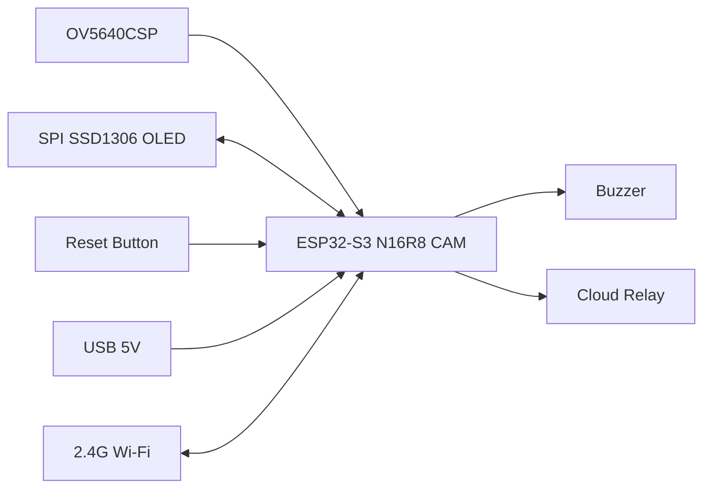
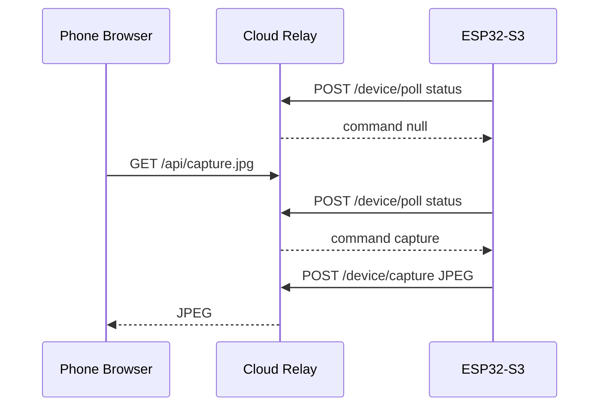

# 技术架构

## 目标

设备本地完成桌前坐姿检测、久坐计时、OLED 显示和蜂鸣器提醒。网络分两层：

- 本地兜底：`Bell-Robot` 热点用于首次配置、联网失败后的修复和现场调试。
- 云端远程：设备主动连接云中转，手机通过服务器网页远程查看状态、修改设置、重置和按需获取摄像头快照。

## 硬件

## 固件模块

- `camera_capture`：采集灰度图，提供本地预览、样本导出和云端按需 JPEG 快照。
- `seat_model`：对 `8x8` 灰度特征做本地 int8 二分类，输出桌前坐姿概率。
- `presence_detector`：模型优先，模型不可用时回退 ROI 灰度差分，并做连续帧去抖。
- `sedentary_timer`：处理待机、计时、暂离暂停、超时重置和提醒状态。
- `display_ui`：OLED 只显示状态、倒计时和 `PROB xx%`。
- `web_api`：本地 AP/LAN 调试接口，包括 `/capture`、`/status`、`/settings`、`/cloud`、`/reset`、`/label`。
- `cloud_client`：STA 联网后每秒轮询云中转，上报状态并执行云端命令。

## 远程访问数据流

## 隐私边界

- 设备默认不持续上传画面。
- 只有手机网页请求 `/api/capture.jpg` 时，设备才上传一张 JPEG。
- 云中转 v1 只在内存中暂存状态、命令和当前快照，不落盘保存图片。
- 坐姿识别和计时仍在设备本地完成，不依赖云端模型。
